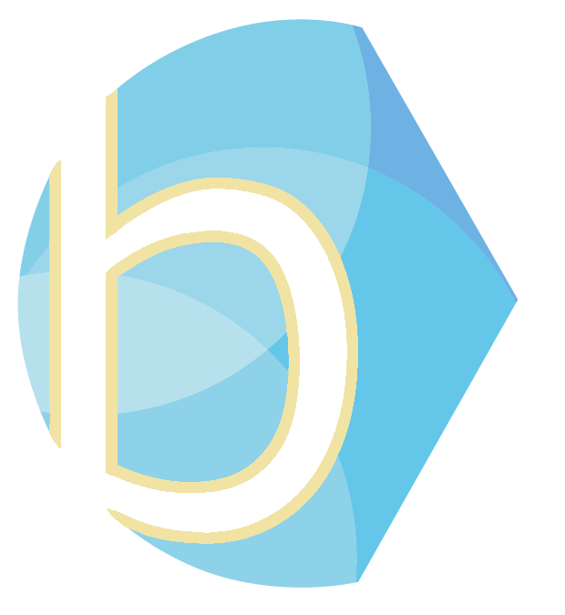

<html lang="en">
<head>
<meta charset="UTF-8">
<meta name="viewport" content="width=device-width, initial-scale=1.0">
<title>Bright Blue Europe</title>
<link rel="shortcut icon" type="image/x-icon" href="favicon.ico">
<link rel="preconnect" href="https://fonts.googleapis.com">
<link rel="preconnect" href="https://fonts.gstatic.com" crossorigin>
<link href="https://fonts.googleapis.com/css2?family=Fraunces:ital,opsz,wght@0,9..144,300;0,9..144,400;0,9..144,500;1,9..144,300;1,9..144,400;1,9..144,500&family=Outfit:wght@300;400;500&display=swap" rel="stylesheet">

</head>
<body>

<!-- NAV -->
<nav id="nav" class="solid">
  <a class="nav-brand" href="#home">
    
          

    Bright Blue Europe
    The home of the centre-right across Europe 

  </a>
  <ul class="nav-links">
    <li></li>    
    <li><a href="#home">Home</a></li>
    <li><a href="#about">About</a></li>
    <li><a href="#staff">Our team</a></li>
    <li><a href="#publications">Publications</a></li>
    <li><a href="#contact">Contact</a></li>
  </ul>
  <a class="nav-btn" href="https://www.brightblue.org.uk">Bright Blue UK</a>
  <button class="nav-burger" id="navBurger" aria-label="Open menu" aria-expanded="false">
    
  </button>
</nav>

<!-- MOBILE MENU OVERLAY -->

  <a href="#home"        onclick="closeMobileNav()">Home</a>
  <a href="#about"       onclick="closeMobileNav()">About</a>
  <a href="#staff"       onclick="closeMobileNav()">Our team</a>
  <a href="#publications" onclick="closeMobileNav()">Publications</a>
  <a href="#contact"     onclick="closeMobileNav()">Contact</a>
  <a class="nav-btn" href="https://www.brightblue.org.uk">Bright Blue UK</a>

<!-- HERO -->
<section id="home">
  <!-- Slideshow slides — add/remove slides here as needed -->
          

  

    

  

      

  

  

    
Bright Blue Europe

    <h1 class="hero-headline">The home of the <em>centre-right</em> across Europe</h1>
    
An independent centre-right think tank solving public policy challenges across the European continent.

    

      <a href="#publications" class="btn-gold">Read our research</a>
      <a href="#about" class="btn-ghost">Who we are</a>
    

  

 <!-- Slideshow dots -->
  

    
  

</section>

<!-- ABOUT -->
<section id="about">
  

    

      

    

    

      
About us

      <h2 class="section-heading reveal d1">We champion  <em>centre-right</em> ideas in Europe</h2>
      
Bright Blue Europe was established in 2026 by Lukas Wick and Bartek Staniszewski as an affiliate of Bright Blue UK — Britain's leading centre-right think tank — bringing the same commitment to non-partisan, centre-right policy to the European stage.

      
We have affiliates in Germany, Poland, Belgium, the Netherlands, Spain and the UK working on challenges common to European governments across social, economic and security policy.

      <a href="#staff" class="about-cta-link reveal d4">Meet our team</a>
    

  

  

    

      

        
Our principles

        <h3 class="pillars-headline reveal d1">What we <em>stand for</em></h3>
      

      

        

          
01

          
Conservatism

          
It is easier to destroy than build. Cherished traditions and institutions must be protected against populist vandalism.

        

        

          
02

          
Liberty

          
People generally know what is best for them better than the state. We champion free trade, competitive markets and enterprise as the surest route to broad-based prosperity.

        

        

          
03

          
Internationalism

          
Most policy issues require international cooperation to be successfully addressed. Strong countries are only possible with strong allies.

        

        

          
04

          
Neutrality

          
The good of Europe, not party politics, guide our work. We retain full editorial control over all of our outputs.

        

      

    

  

</section>

<!-- STAFF -->
<section id="staff">
  

    

      

        
Our team

        <h2 class="section-heading reveal d1">The <em>people</em> behind the project</h2>
      

    

    

      <!-- Lukas Wick -->
      

        
        

        

          
Co-Founder

          
Lukas Wick

          
Lukas worked at the Konrad-Adenauer-Stiftung in London and in Brussels, advising on EU and NATO security and defence policy. He had also served as Head of Unit at the Representation of the State of Hesse to the EU and holds a Master’s in International Security from the IBEI.

          

            Communications
            Engagement
            Security
            EU
          

          

            <a href="https://www.linkedin.com/in/lukaswick/" class="staff-social" aria-label="LinkedIn">
              <svg viewBox="0 0 24 24"><path d="M16 8a6 6 0 016 6v7h-4v-7a2 2 0 00-2-2 2 2 0 00-2 2v7h-4v-7a6 6 0 016-6z"/><rect x="2" y="9" width="4" height="12"/><circle cx="4" cy="4" r="2"/></svg>
            </a>
            <a href="#" class="staff-social" aria-label="X">
              <svg viewBox="0 0 24 24"><line x1="18" y1="6" x2="6" y2="18"/><line x1="6" y1="6" x2="18" y2="18"/></svg>
            </a>
            <a href="mailto:lukas@eubrightblue.org" class="staff-social" aria-label="Email">
              <svg viewBox="0 0 24 24"><path d="M4 4h16c1.1 0 2 .9 2 2v12c0 1.1-.9 2-2 2H4c-1.1 0-2-.9-2-2V6c0-1.1.9-2 2-2z"/><polyline points="22,6 12,13 2,6"/></svg>
            </a>
          

        

      

      <!-- Bartek Staniszewski -->
      

        
        

        

          
Co-Founder

          
Bartek Staniszewski

          
Bartek worked as Head of Research for Bright Blue in London. He is a frequent columnist for the Spectator and Critic, the Editor-in-Chief of Centre Write, an IPR Policy Fellow of the University of Bath and a Fellow of the Centre for Family and Education.

          

            Social policy
            Research
            Poland
            UK
          

          

            <a href="https://www.linkedin.com/in/bastaniszewski/" class="staff-social" aria-label="LinkedIn">
              <svg viewBox="0 0 24 24"><path d="M16 8a6 6 0 016 6v7h-4v-7a2 2 0 00-2-2 2 2 0 00-2 2v7h-4v-7a6 6 0 016-6z"/><rect x="2" y="9" width="4" height="12"/><circle cx="4" cy="4" r="2"/></svg>
            </a>
            <a href="https://x.com/BGStaniszewski" class="staff-social" aria-label="X">
              <svg viewBox="0 0 24 24"><line x1="18" y1="6" x2="6" y2="18"/><line x1="6" y1="6" x2="18" y2="18"/></svg>
            </a>
            <a href="mailto:bartek@eubrightblue.org" class="staff-social" aria-label="Email">
              <svg viewBox="0 0 24 24"><path d="M4 4h16c1.1 0 2 .9 2 2v12c0 1.1-.9 2-2 2H4c-1.1 0-2-.9-2-2V6c0-1.1.9-2 2-2z"/><polyline points="22,6 12,13 2,6"/></svg>
            </a>
          

        

      

    

  

</section>

<!-- PUBLICATIONS -->
<section id="publications">
  

    

      

        
Research &amp; publications

        <h2 class="section-heading reveal d1">Bright Blue's <em>latest</em> thinking</h2>
      

      <a href="https://www.brightblue.org.uk/libary-new/" class="pub-all-link reveal">View all publications</a>
    

    

      <button class="pub-filter-btn active" onclick="filterPubs('all',this)">All</button>
      <button class="pub-filter-btn" onclick="filterPubs('politics',this)">Politics</button>
      <button class="pub-filter-btn" onclick="filterPubs('social',this)">Social policy</button>
      <button class="pub-filter-btn" onclick="filterPubs('economy',this)">Economy</button>
      <button class="pub-filter-btn" onclick="filterPubs('security',this)">Security</button>
    

    

 
      <!-- LARGE CARD — replace href with the real link -->
      <a class="pub-card large" data-tag="politics" href="https://www.brightblue.org.uk/portfolio/right-road/" target="_blank" rel="noopener">
        
Politics

        
The right road

        <!-- Replace src with your own publication cover image if you have one -->
        
        
The future of the European centre-right

        
June 2025→

      </a>
 
      <!-- Replace each href with the real publication URL -->
      <a class="pub-card" data-tag="economy" href="https://www.brightblue.org.uk/portfolio/higher-ground-living-standards/" target="_blank" rel="noopener">
        
Economy

        
Higher ground

        
A centre-right vision to raise living standards

        
March 2026→

      </a>
 
      <a class="pub-card" data-tag="security" href="https://www.brightblue.org.uk/portfolio/properly-protected/" target="_blank" rel="noopener">
        
Security

        
Properly protected

        
Reducing victims and abuses of modern slavery in the UK's asylum system

        
December 2025→

      </a>
 
      <a class="pub-card" data-tag="economy" href="https://www.brightblue.org.uk/portfolio/tax-reform-growth/" target="_blank" rel="noopener">
        
Economy

        
Tax Reforms for Growth

        
Seven packages of reform

        
November 2025→

      </a>
 
      <a class="pub-card" data-tag="social" href="https://www.brightblue.org.uk/portfolio/mending-the-net/" target="_blank" rel="noopener">
        
Social policy

        
Mending the net?

        
A new centre-right approach to social security

        
October 2025→

      </a>
 
    

  

</section>

<!-- CONTACT — full width, no form -->
<section id="contact">
  

    
Contact us

    <h2 class="section-heading reveal d1">Work with <em>us</em></h2>
    
We welcome enquiries from policymakers, journalists and partner organisations across Europe.

    

      

        Address
        Sokratesa 6/20 01-909 Warsaw, Poland
      

      

        Email
        <a href="mailto:bartek@eubrightblue.org">bartek@eubrightblue.org</a> <a href="mailto:lukas@eubrightblue.org">lukas@eubrightblue.org</a>
      

      

        Phone
        <a href="tel:+48732434093">+48 732 434 093</a> <a href="tel:+4915126961354">+49 151 26961354</a>
      

      

        Parent organisation
        <a href="https://www.brightblue.org.uk" target="_blank">Bright Blue UK ↗</a>
      

    

  

</section>

<!-- FOOTER -->
<footer>
  
<strong>Bright Blue Europe</strong> &nbsp;·&nbsp; The home of the centre-right across Europe

  <ul class="footer-nav">
          <li></li>
    <li><a href="#home">Home</a></li>
    <li><a href="#about">About</a></li>
    <li><a href="#staff">Team</a></li>
    <li><a href="#publications">Publications</a></li>
    <li><a href="#contact">Contact</a></li>
    <li><a href="https://www.brightblue.org.uk" target="_blank">Bright Blue UK</a></li>
  </ul>
  
&copy; 2026 Bright Blue Europe. All rights reserved.

</footer>

</body>
</html>
